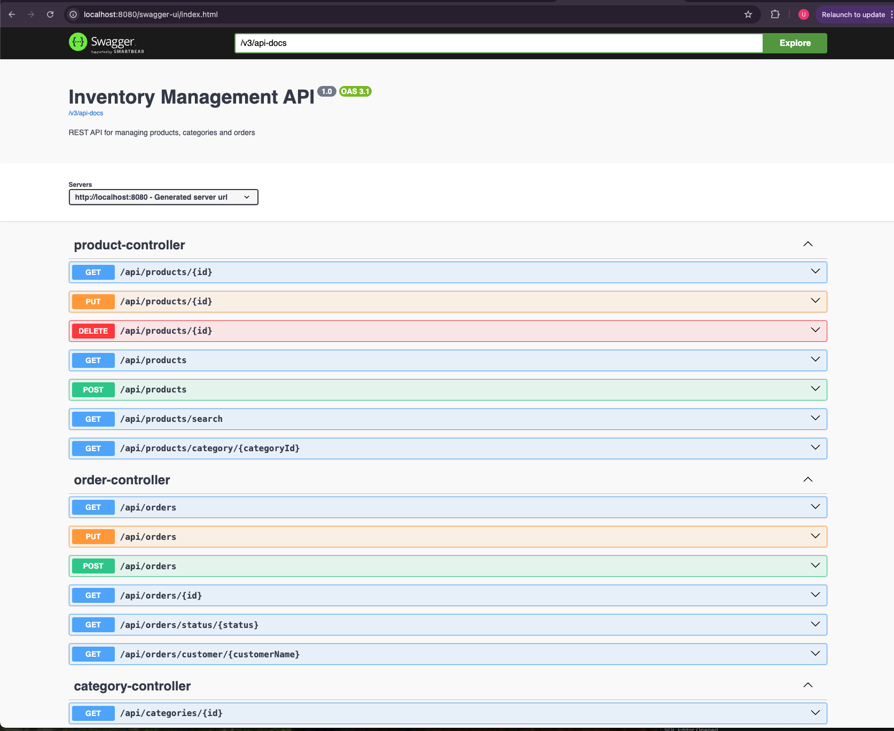

# Inventory Management System

A production-grade REST API built with Java and Spring Boot for managing products, categories, and orders.

## Tech Stack

- Java 17
- Spring Boot 3.5
- Spring Data JPA / Hibernate
- MySQL
- Docker + Docker Compose
- JUnit 5 + Mockito (Unit & Integration Tests)
- Swagger / OpenAPI Documentation

## Features

- Category management — CRUD operations
- Product management — CRUD + search by keyword
- Order management — place orders with automatic stock validation
- Global exception handling with @ControllerAdvice
- Unit tests with JUnit 5 and Mockito
- Integration tests with MockMvc
- Dockerized with Docker Compose
- API documentation with Swagger UI

## How to Run

### Option 1 — Docker (Recommended)

```bash
docker-compose up --build
```

App runs at: `http://localhost:8080`

### Option 2 — Local

1. Make sure MySQL is running
2. Create database: `CREATE DATABASE inventory_db;`
3. Update `src/main/resources/application.properties` with your MySQL credentials
4. Run the app from IntelliJ

## API Documentation

After running the app, open

Swagger UI: [http://localhost:8080/swagger-ui/index.html](http://localhost:8080/swagger-ui/index.html)


## API Endpoints

### Categories
| Method | URL | Description |
|--------|-----|-------------|
| GET | /api/categories | Get all categories |
| POST | /api/categories | Create category |
| GET | /api/categories/{id} | Get by ID |
| PUT | /api/categories/{id} | Update category |
| DELETE | /api/categories/{id} | Delete category |

### Products
| Method | URL | Description |
|--------|-----|-------------|
| GET | /api/products | Get all products |
| POST | /api/products | Create product |
| GET | /api/products/{id} | Get by ID |
| GET | /api/products/search?keyword= | Search by keyword |
| GET | /api/products/category/{id} | Get by category |
| PUT | /api/products/{id} | Update product |
| DELETE | /api/products/{id} | Delete product |

### Orders
| Method | URL | Description |
|--------|-----|-------------|
| GET | /api/orders | Get all orders |
| POST | /api/orders | Place new order |
| GET | /api/orders/{id} | Get by ID |
| GET | /api/orders/customer/{name} | Get by customer |
| GET | /api/orders/status/{status} | Get by status |
| PUT | /api/orders/{id}/status | Update status |





## Running Tests

```bash
mvn test
```

## Live Demo
API: https://inventory-management-opom.onrender.com
Swagger UI: https://inventory-management-opom.onrender.com/swagger-ui/index.html

## Note: Free tier — app may take 30-50 seconds to wake up on first request.

## Author

Backend Developer — Berlin, Germany
GitHub: github.com/UshaM22

